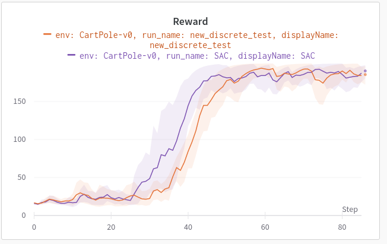

# Conservative Q-Learning (CQL)
PyTorch implementation of the CQL algorithm ([Paper](https://arxiv.org/pdf/2006.04779.pdf)). Including the discrete action space DQN-CQL version, the continuous action space SAC-CQL version and a discrete CQL-SAC implementation. 


# Setup 
-> conda environment [ ]
-> requirement.txt [ ]

# Run 
Select the folder [CQL-DQN, CQL-SAC, CQL-SAC-discrete] of the algorithm you want to train and run: `python train.py`
# Online RL Results: 
## Base CQL-DQN 


## CQL-SAC


## CQL-SAC-discrete 
Comparison of a discrete CQL-SAC implementations vs the normal discrete SAC.

#### CartPole


#### LunarLander

# Offline RL Results:

# Results
Find all training results and hyperparameter in the [wandb project](https://wandb.ai/sebastian-dittert/CQL?workspace=).

# TODO:
- update readme [ ]
- add distributional Q-Function [ ]

## Help and issues:
Im open for feedback, found bugs, improvements or anything. Just leave me a message or contact me.

## Author
- Sebastian Dittert

**Feel free to use this code for your own projects or research.**
```
@misc{SAC,
  author = {Dittert, Sebastian},
  title = {CQL},
  year = {2021},
  publisher = {GitHub},
  journal = {GitHub repository},
  howpublished = {\url{https://github.com/BY571/CQL}},
}
```

